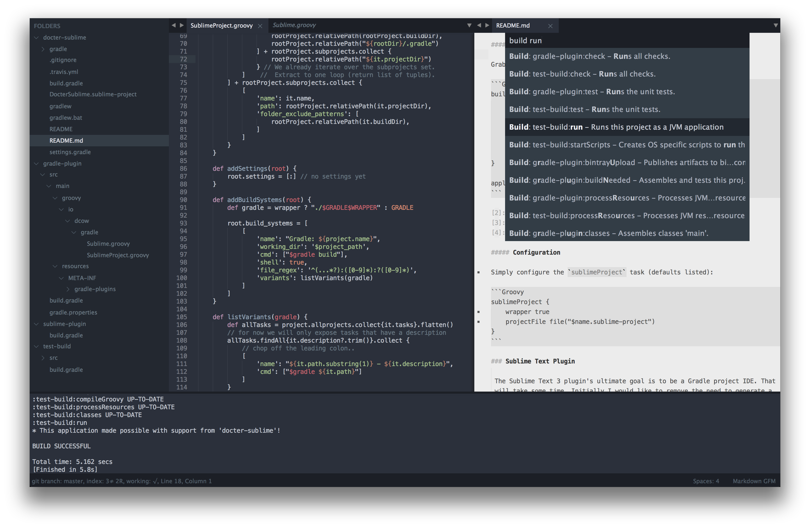

# DocterSublime

Tools for developing Gradle projects using Sublime Text 3.



### Gradle Plugin

 

Applying the `sublime` plugin adds a task named `sublime` to your Gradle project. Executing the task causes a '*<b>Name</b>.sublime-project*' file to be generated with configuration inforamtion relevant to Sublime Text. The project description is complete with an inline Sublime *build system*. This means all your project's tasks will be available via the command palette.

The drawback of this approach is that updating your project is not fluid. Sublime Text stores your latest configuration in a '*<b>Name</b>.sublime-workspace*' file. Sublime also [seems to have issues reloading project information][1]. So, ideally we need a Sublime Text plugin that will *dynamically update the editor whenever a build script change is made*.

A Sublime Text plugin does not obselete a Gradle plugin. The plugin also configures Sublime with the names and paths of your Gradle subprojects and excludes your projects build directories. In fact, it allows you to configure any arbitrary project-specific Sublime Text setting. 

[1]: https://www.sublimetext.com/forum/viewtopic.php?f=2&t=5342#p37042 

##### Setup

Grab the [lastest version][2] ([0.9.0][3]) from [jcenter][4]:

```Groovy
buildscript {
    repositories {
        jcenter()
    }
    dependencies {
        classpath 'io.dcow.gradle:sublime:0.9.+'
    }
}

apply plugin: 'io.dcow.sublime'
```

[2]: https://bintray.com/dcow/maven/sublime/view
[3]: https://bintray.com/dcow/maven/sublime/0.9.0/view
[4]: https://bintray.com/bintray/jcenter

##### Configuration

Simply configure the `sublimeProject` task (defaults listed):

```Groovy
sublimeProject {
    wrapper true
    projectFile file("$name.sublime-project")
}
```

### Sublime Text Plugin

 The Sublime Text 3 plugin's ultimate goal is to be a Gradle project IDE. That will take some time. Initially I would like to remove the need to generate a static build system description by dynamically adding commands to Sublime.

 Then lint, code completion, and *maybe* debugging.

